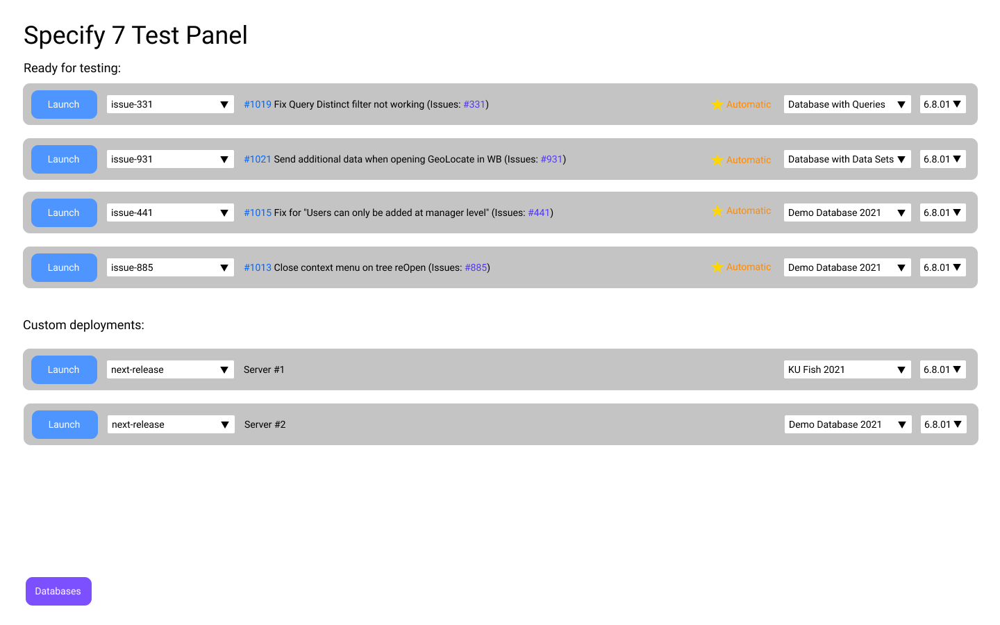

# Specify 7 Test Panel

A cluster of Specify 7 instances for testing with automatic deployment,
authentication and a test panel for setting configuration.

These instructions have last been updated and tested on Ubuntu 24.04 with MariaDB 11.4 and Docker 27.1.2. 



## Generate SSL certificates

To run the containers, generate `fullchain.pem` and `privkey.pem` (certificate
and the private key) using Let's Encrypt and put these files into the
`./config/` directory.

### Development
While in development, you can generate self-signed certificates:

```zsh
openssl req \
  -x509 -sha256 -nodes -newkey rsa:2048 -days 365 \
  -keyout ./config/privkey.pem \
  -out ./config/fullchain.pem
```
### Production
In a production environment, the deployment expects `privkey.pem` and `fullchain.pem` to be in
the `/etc/letsencrypt/live/test.specifysystems.org-0001/privkey.pem` directory

Before the Test Panel is running, you can install `nginx` locally 

```bash
sudo apt install nginx
sudo service nginx start
```

The SSL certs must be for both `test.specifysystems.org` and `*.test.specifysystems.org`.
We use [DigitalOcean to manage the DNS configuration](https://www.digitalocean.com/community/tutorials/how-to-create-let-s-encrypt-wildcard-certificates-with-certbot) (Dreamhost doesn't support wilcard certificates).

Follow [these instructions](https://www.digitalocean.com/community/tutorials/how-to-create-let-s-encrypt-wildcard-certificates-with-certbot) to create the `~/certbot-creds.ini` file necessary to generate the SSL certificates.

Once it is started, you can use certbot to generate the certificates:

```bash
sudo certbot certonly --dns-digitalocean --dns-digitalocean-credentials ~/certbot-creds.ini -d test.specifysystems.org,*.test.specifysystems.org
```

Now that this is done, make sure to remove the local `nginx` installation so it does not conflict with the one in Docker:

```
sudo systemctl stop nginx
sudo apt-get purge nginx
```

## Create a GitHub OAuth App

In order to enable authentication though GitHub and usage of GitHub APIs, a
GitHub OAuth application needs to be created.

This can be done for a GitHub organization or user profile:

1. Open organization / user settings on GitHub
1. On the sidebar, select "Developer Settings"
1. Select "OAuth Apps"
1. Press "New OAuth App"
1. Fill out the required information
1. Set authentication callback URL to this URL:

   ```
   https://localhost/sign-in
   ```

   When in production, replace `localhost` with the actual hostname

1. Press "Generate a new client secret"
1. Client ID and Client Secret is displayed on the OAUth app configuration page.
1. Write them down somewhere temporary as they would be needed later

## Configure automatic deployment

Most GitHub API calls would be made using the token generated when the user
authenticates into the system.

The only exception is the webhook endpoint (`/api/webhook`), which would be
called by GitHub whenever the list pull requests that are ready for testing.

This endpoint is responsible for checking getting rid of stale instances and
auto deploying new pull requests whenever they become ready for testing.

### Creating Authentication Token

To configure this, first, create personal authentication token:

1. Open your GitHub's profile settings
1. Select "Developer Settings" on the sidebar
1. Select "Personal access tokens" on the next sidebar
1. Press "Generate new token"
1. Fill out name and expiration date as appropriate
1. Check the `read:org` checkbox in the "Select Scopes" section
1. Press "Generate token"
1. Write down the generated token temporarily as it would be needed in the next
   step

### Configuring webhook

Next, let's setup the webhook:

1. Open the repository settings page
1. Select "Webhooks" on the sidebar
1. Press "Add webhook"
1. Set `https://test.specifysolutions.com/api/webhook` as the payload URL.
   Replace the domain name and the protocol with the one you are using.

   ```
   NOTE:
   In order for webhook to work, this domain has to be
   publicly accessible on the internet.

   If you need to test webhooks on your local machine,
   Google how to expose localhost
   ```

1. Change "Content type" picklist to `application/json`
1. Select the "Let me select individual events." radio button.
1. Check the following checkboxes:

   - Pull request review comments
   - Pull request review threads
   - Pull request reviews
   - Pull requests
   - Workflow jobs

1. Click the "Add webhook" button

## Configure Next.JS

Create `.env.local` file in the `app` folder:

```ini
NEXT_PUBLIC_GITHUB_CLIENT_ID=<client_id>
GITHUB_CLIENT_SECRET=<client_secret>

GITHUB_PERSONAL_TOKEN=<github_token>

MYSQL_USERNAME=root
MYSQL_PASSWORD=root
MYSQL_HOST=mariadb

REPORT_RUNNER_HOST=report-runner

SECRET_KEY=<secret_key>

ASSET_SERVER_KEY=<asset_secret_key>
ASSET_SERVER_URL=asset-server
```

### Using RDS

Since we do not use MariaDB in Docker when working with Amazon RDS, you need to set up the connection details in this same file:

```ini
NEXT_PUBLIC_GITHUB_CLIENT_ID=<client_id>
GITHUB_CLIENT_SECRET=<client_secret>

GITHUB_PERSONAL_TOKEN=<github_token>

MYSQL_USERNAME=<master_username>
MYSQL_PASSWORD=<master_password>
MYSQL_HOST=something.something.us-east-1.rds.amazonaws.com
```

### Configuration

Replace `<client_id>` and `<client_secret>` with the actual values from the
OAuth app configuration page on GitHub
([see more details](#create-a-github-oauth-app))

Replace `<github_token>` with the token you generated in
[the previous step](#configure-automatic-deployment)

## Setup cleanup cron job

To avoid memory leaks, setup a cron job that runs `docker system prune --all` at
a regular schedule (i.e at 3am every day).
[Example tutorial](https://www.digitalocean.com/community/tutorials/how-to-use-cron-to-automate-tasks-ubuntu-1804)

Open the cron file:

```sh
crontab -e
```

Add this line:

```sh
0 3 * * * docker system prune --all --volumes --force
```

## Deployment

After completing all the steps from previous sections, do one of these:

### Production

Build the containers:

```shell
docker compose \
  -f docker-compose.yml \
  -f docker-compose.production.yml \
  up --no-start --build
```

Run the containers:

```zsh
docker compose \
  -f docker-compose.yml \
  -f docker-compose.production.yml \
  -f /var/lib/docker/volumes/specify7-test-panel_state/_data/docker-compose.yml \
  up --remove-orphans -d
```

If `/var/lib/docker/volumes/specify7-test-panel_state/_data/docker-compose.yml`
is not correct on your host, you can find the correct path using
`docker volume ls` and `docker volume inspect`.

Test Panel is now available at [https://localhost/](https://localhost/)

### Development

Install npm dependencies locally:

```zsh
npm i
```

Run the containers:

```zsh
docker compose \
  -f docker-compose.yml \
  -f docker-compose.development.yml \
  -f state/docker-compose.yml \
  up --remove-orphans
```

> This will deploy the development server and the deployments configured in the
> test panel. If there is no need to start the configured deployments, omit the
> `-f state/docker-compose.yml \ ` line from above.
>
> If deployments, are not started, there would be a lot of errors in the dev
> console in the test panel. You can silence those by disabling deployment
> status fetching by adding "?no-fetch" to the url (https://localhost/?no-fetch)

Test Panel is now available at [https://localhost/](https://localhost/)

Next.JS has hot-reload enabled, so code changes are reflected in realtime.

Before committing changes, run `npm run test` to verify validity of TypeScript
types.

## Watch for configuration file changes

You can choose either approach. You do not need to use both `systemd` and `fswatch` solutions as they do the same thing.

The `systemd` approach may be preferable as it can be configured to automatically start when the system boots up.

### Using systemd

After user changes the configuration in the panel, the file
`/var/lib/docker/volumes/specify7-test-panel_state/_data/docker-compose.yml` is
modified. Systemd can be configured to watch this file and run docker-compose
pull and up when changes occur. Use the following unit files:

#### /etc/systemd/system/specify7-test-panel-update.service

```
[Unit]
After=network.target
Description=Run docker-compose up for test panel.

[Service]
Type=oneshot
WorkingDirectory=/home/ubuntu/specify7-test-panel
ExecStart=docker compose -f docker-compose.yml -f docker-compose.production.yml -f /var/lib/docker/volumes/specify7-test-panel_state/_data/docker-compose.yml up --remove-orphans -d
```

#### /etc/systemd/system/specify7-test-panel-update.path

```
[Unit]

[Path]
PathChanged=/var/lib/docker/volumes/specify7-test-panel_state/_data/docker-compose.yml
Unit=specify7-test-panel-update.service

[Install]
WantedBy=multi-user.target
```

Enable the services with the following commands:

```
systemctl daemon-reload
systemctl enable specify7-test-panel-update.path
systemctl start specify7-test-panel-update.path
```

### Emulating x86_64 for Specify 6 images

Using an emulation layer like `binfmt_misc` or `docker-run-arm` can help you run `x86_64` images on an `arm64` platform.

Here's an example of how you can use `binfmt_misc` to run `x86_64` images on an `arm64` platform:

1. Install `binfmt_misc` on your system:
```
sudo apt-get update
sudo apt-get install binfmt-support qemu-user-static
```
2. Configure `binfmt_misc` to enable emulation:
```
sudo update-binfmts --enable
```
3. Create a `binfmt_misc` configuration file to enable `x86_64` emulation:
```
sudo tee /proc/sys/fs/binfmt_misc/register <<EOF
:x86_64:M::\x7fELF\x02\x01\x01\x00\x00\x00\x00\x00\x00\x00\x00\x00\x02\x00\x3e\x00:\xff\xff\xff\xff\xff\xfe\xff\xff\xff\xff\xff\xff\xff\xff\xff\xff\xfe\xff\xff\xff:/usr/bin/qemu-x86_64-static:
EOF
```
4. Reload the `binfmt_misc` configuration:
```
sudo mount -t binfmt_misc none /proc/sys/fs/binfmt_misc
```
5. Update your `docker-compose.yml` file to use the `x86_64` architecture:
```
specify6803:
  image: specifyconsortium/specify6-service:6.8.03
  architecture: x86_64
  volumes:
    - specify6803:/opt/Specify
```
6. Run `docker-compose up` to start the containers:
```
docker-compose up
```


### Using fswatch

After user changes the configuration in the panel, `./state/docker-compose.yml`
file is modified.

`fswatch` can be used to rerun `docker-compose up` on configuration changes.

Install `fswatch`:

```bash
# on Ubuntu
sudo apt-get install fswatch
# on macOS
brew install fswatch
```

Then, run this command though nohup:

```bash
fswatch -o ./state/docker-compose.yml | xargs -n1 -I{} sh -c " \
docker-compose \
  -f docker-compose.yml \
  -f docker-compose.production.yml \
  -f state/docker-compose.yml \
  up --remove-orphans -d"
```

## Miscellaneous

### Initial State

The `./state` directory is indexed by git, but changes are ignored

This was achieved like this:

1. Add `./state/` directory with initial content to git and commit changes
1. Add `./state/` folder to `.gitignore`
1. Run `git update-index --assume-unchanged state/docker-compose.yml` (do this
   for each file in that directory)

In the future, if you want to change the default `./state/`, run this (for each
file):

```
git update-index --no-assume-unchanged state/docker-compose.yml
```

Then, commit your changes and repeat step 3
