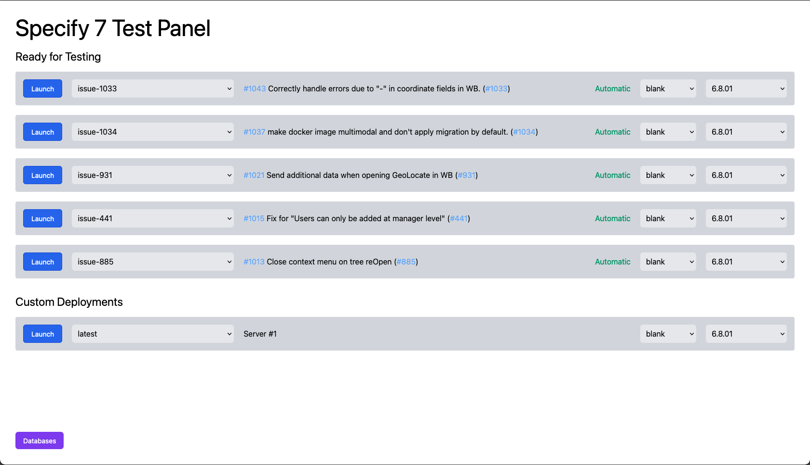

# Specify 7 Test Panel

A cluster of Specify 7 instances for testing with automatic deployment,
authentication and a test panel for setting configuration



## Deployment

To run the containers, generate `fullchain.pem` and `privkey.pem` (certificate
and the private key) using Let's Encrypt and put these files into the
`./config/` directory.

While in development, you can generate self-signed certificates:

```zsh
openssl req \
  -x509 -sha256 -nodes -newkey rsa:2048 -days 365 \
  -keyout ./config/privkey.pem \
  -out ./config/fullchain.pem
```

### Create a GitHub OAuth App

In order to enable authentication though GitHub and usage of GitHub APIs, a
GitHub OAuth application needs to be created.

This can be done for a GitHub organization or user profile:

1. Open organization / user settings on GitHub
1. On the sidebar, select "Developer Settings"
1. Select "OAuth Apps"
1. Press "New OAuth App"
1. Fill out the required information
1. Set authentication callback URL to this URL:

   ```
   https://localhost/sign-in
   ```

   When in production, replace `localhost` with the actual hostname

1. Press "Generate a new client secret"
1. Client ID and Client Secret is displayed on the OAUth app configuration page.
1. Write them down somewhere temporary as they would be needed later

### Configure automatic deployment

Most GitHub API calls would be made using the token generated when the user
authenticates into the system.

The only exception is the webhook endpoint (`/api/webhook`), which would be
called by GitHub whenever the list pull requests that are ready for testing.

This endpoint is responsible for checking getting rid of stale instances and
auto deploying new pull requests whenever they become ready for testing.

To configure this, first, create personal authentication token:

1. Open your GitHub's profile settings
1. Select "Developer Settings" on the sidebar
1. Select "Personal access tokens" on the next sidebar
1. Press "Generate new token"
1. Fill out name and expiration date as appropriate
1. Check the `read:org` checkbox in the "Select Scopes" section
1. Press "Generate token"
1. Write down the generated token temporarily as it would be needed in the next
   step

Next, let's setup the webhook:

1. Open the repository settings page
1. Select "Webhooks" on the sidebar
1. Press "Add webhook"
1. Set `https://test.specifysolutions.com/api/webhook` as the payload URL.
   Replace the domain name and the protocol with the one you are using.

   ```
   NOTE:
   In order for webhook to work, this domain has to be
   publicly accessible on the internet.

   If you need to test webhooks on your local machine,
   Google how to expose localhost
   ```

1. Change "Content type" picklist to `application/json`
1. Select the "Let me select individual events." radio button.
1. Check the following checkboxes:

   - Pull request review comments
   - Pull request review threads
   - Pull request reviews
   - Pull requests
   - Workflow jobs

1. Click the "Add webhook" button

### Configure Next.JS

Create `.env.local` file in the root folder of this repository:

```ini
NEXT_PUBLIC_GITHUB_CLIENT_ID=<client_id>
GITHUB_CLIENT_SECRET=<client_secret>

GITHUB_PERSONAL_TOKEN=<github_token>

MYSQL_USERNAME=root
MYSQL_PASSWORD=root
MYSQL_HOST=mariadb
```

Replace `<client_id>` and `<client_secret>` with the actual values from the
OAuth app configuration page on GitHub
([see more details](#create-a-github-oauth-app))

Replace `<github_token>` with the token you generated in
[the previous step](#configure-automatic-deployment)

### Production

Run the containers:

```zsh
docker-compose -f docker-compose.production.yml up -d
```

Test Panel is now available at [https://localhost/](https://localhost/)

### Development

Run the containers:

```zsh
docker-compose up
```

Test Panel is now available at [https://localhost/](https://localhost/)

Next.JS has hot-reload enabled, so code changes are reflected in realtime.

Before committing changes, run `npm run test` to verify validity of TypeScript
types.
